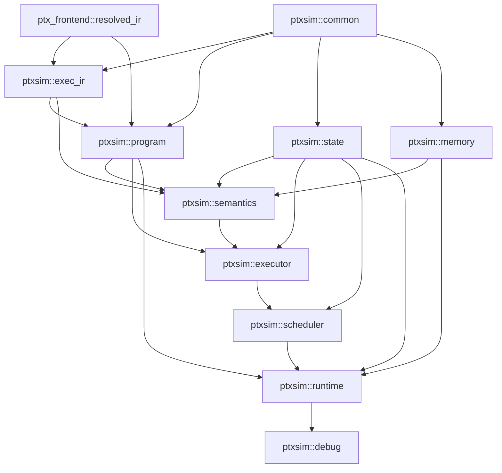

# ptxsim Project Plan

> 文档状态：Draft v0.3  
> 编写日期：2026-08-25  
> 项目：`ptxsim`  
> 规范参考基线：NVIDIA PTX ISA 9.3  
> 前端依赖：[`endingly/ptx_frontend`](https://github.com/endingly/ptx_frontend)

## 0. 项目决策摘要

`ptxsim` 的第一阶段目标是实现一个**确定性的 PTX functional ISA simulator**：输入由 `ptx_frontend` 解析并完成语义解析后的 Resolved IR；`ptxsim` 首先将其 lowering 为 simulator-owned 的 `exec_ir`，再负责程序装载、机器状态、内存空间、指令执行语义、线程/CTA/SIMT 调度、同步以及可调试的运行时接口。

本项目从一开始采用以下约束：

1. **Resolved IR 是 frontend 与 simulator 的正式输入边界。** `ptxsim` 不重新 tokenize/parse PTX，不重复做 opcode variant 选择、符号绑定和 target legality 检查。
2. **`exec_ir` 是 simulator 内部的正式执行边界。** `ptx_frontend::resolved_ir` 必须先 lowering 为 `ptxsim::exec_ir`；`semantics`、`executor`、`scheduler` 不直接依赖 frontend IR。`exec_ir` 只保存执行所需的、已经规范化/索引化的信息。
3. **`exec_ir` 不是 SASS。** 第一阶段不表达真实 NVIDIA machine instruction encoding、physical register allocation、instruction scheduling 或 architecture-specific micro-op；如果未来实现 SASS/microarchitecture simulator，应建立独立的 target-specific machine IR，而不是把 `exec_ir` 逐渐伪装成 SASS。
4. **先实现 functional correctness，再考虑 timing/performance model。** 第一版不模拟真实 SM pipeline、cache latency、occupancy、scoreboard 或 cycle-accurate warp scheduler。
5. **执行结果必须可复现。** 默认 scheduler 使用确定性策略；同一输入、launch configuration 和 simulator configuration 应产生相同的结果与 dump。
6. **存储状态 dump 是一等调试能力。** `.global/.const/.param/.shared/.local` 提供统一的 addressable-memory snapshot/dump 接口；Tensor Memory（TMEM）作为专用 storage resource 提供独立的二维 snapshot/dump 接口。未初始化数据必须可区分，不能静默伪装为有效零值。
7. **模块边界通过 CMake target 强制表达。** 源码目录、public include 路径、CMake target 与 namespace 保持一致。
8. **借鉴 `ptx_frontend` 的 CMake 组织方式，但不机械复制。** 顶层 CMake 保持很薄；各模块拥有独立 `CMakeLists.txt`；实现型模块使用正常 library，而不是普遍使用 `INTERFACE + target_sources(INTERFACE)`。
9. **真实 CMake target 必须使用 `ptxsim_` 前缀。** CMake target 名在整个 build tree 中全局唯一，而 `ptx_frontend` 已存在 `common`、`base`、`syntax` 等真实 target；因此本项目使用 `ptxsim_common`、`ptxsim_memory` 等真实 target，并暴露 `ptxsim::common`、`ptxsim::memory` 等 alias。
10. **PTX ISA 文档版本与实现覆盖率分离。** 本计划以 PTX ISA 9.3 作为规范参考，但每个 opcode/state-space/feature 都必须在 support matrix 中单独标记 simulator 与 frontend 的实现状态。

---

## 1. 项目背景以及相关项目

### 1.1 ptxsim 的定位

PTX 是 NVIDIA 定义的低层并行虚拟 ISA。`ptxsim` 的核心目标不是重新实现一个 PTX compiler，而是实现 PTX 程序在一个可检查、可复现的软件机器模型上的执行。

理想的数据流为：

```text
PTX source
   |
   v
ptx_frontend
   |
   |  tokenize / CST / Syntax AST
   |  binding / declaration semantics
   |  instruction resolution / target checking
   v
ResolvedModule + ResolvedInstruction
   |
   |  lowering / canonicalization
   v
ptxsim::exec_ir
   |
   v
ptxsim::program
   |
   v
ProgramImage<exec_ir::Instruction>
   |
   +-----------------------------+
   |                             |
   v                             v
Machine State                Memory System
   |                             |
   +-------------+---------------+
                 |
                 v
          Instruction Semantics
                 |
                 v
             Executor
                 |
                 v
             Scheduler
                 |
                 v
              Runtime
```

职责边界应当保持为：

- `ptx_frontend` 回答“这段 PTX 在语义上是什么”；
- `ptxsim::exec_ir` 回答“为了执行这些已确定的 PTX 语义，模拟器实际需要保存什么”；
- `ptxsim` 的 execution core 回答“`exec_ir` 指令如何改变机器状态”。

### 1.2 ptx_frontend

项目地址：<https://github.com/endingly/ptx_frontend>

`ptx_frontend` 当前是一个 C++23、pre-1.0 的实验性 frontend。其公开 pipeline 已经形成：

```text
PTX source
  -> lexer
  -> lossless CST
  -> Syntax AST
  -> symbol binding
  -> declaration semantics
  -> Resolved IR
  -> target-aware checking
```

当前 Resolved IR 已采用强类型 opcode variant，例如 `ResolvedInstruction` 为 `std::variant<Add, Sub, Bar, Bra, Mov, Ld, ...>`；resolved operand 中已经可以保存 register identity、immediate bits/type、branch target、special register identity、symbol/address 等 simulator 需要的信息。

因此 `ptxsim` 不应建立一套仅仅把 frontend 类型重新命名、却仍需要运行时查 symbol/label/operand 语义的“伪 IR”。本项目明确增加一层 simulator-owned 的 `exec_ir`，但它的价值必须来自**执行归一化**，而不是复制 frontend AST/Resolved IR。

典型 lowering 包括：

```text
frontend register SymbolId  -> dense RegisterSlot
frontend label SymbolId     -> ProgramCounter / instruction index
resolved operand            -> executable ValueSource / AddressOperand
function SymbolId           -> FunctionId
resolved typed variant      -> execution-oriented typed instruction
```

因此核心语义接口应针对 `exec_ir`：

```cpp
execute(const ptxsim::exec_ir::Add&, ExecutionContext&);
execute(const ptxsim::exec_ir::Mov&, ExecutionContext&);
execute(const ptxsim::exec_ir::Load&, ExecutionContext&);
```

`exec_ir` **不是 SASS IR**：它仍然表达 PTX 的 functional execution semantics，不包含真实机器 encoding、physical register allocation、pipeline scheduling metadata 等 target-specific 信息。未来如果项目扩展到 SASS/timing simulation，应另建 machine-IR/backend 路径。

### 1.3 NVIDIA PTX ISA

规范主参考：

- PTX ISA 9.3：<https://docs.nvidia.com/cuda/parallel-thread-execution/>
- PTX ISA Contents：<https://docs.nvidia.com/cuda/parallel-thread-execution/contents.html>
- CUDA Programming Guide：<https://docs.nvidia.com/cuda/cuda-programming-guide/index.html>
- PTX Writers Guide to Interoperability：<https://docs.nvidia.com/cuda/ptx-writers-guide-to-interoperability/index.html>

PTX ISA 9.3 是本计划编写时 NVIDIA 官方在线文档的当前版本。它定义了 thread hierarchy、CTA/cluster、SIMT、state spaces、instruction semantics、special registers、memory consistency model 等 simulator 的规范语义来源。

### 1.4 GPGPU-Sim

项目：<https://github.com/gpgpu-sim/gpgpu-sim_distribution>

GPGPU-Sim 可作为以下设计问题的参考：

- functional PTX execution 与 performance simulation 的分层；
- CTA/warp 调度与 barrier 的工程实现；
- 大规模 GPU simulator 的测试和配置方式。

但它**不是本项目的行为规范来源**。当 GPGPU-Sim 行为与 PTX ISA 文档存在差异时，应以 PTX ISA 和可验证的 NVIDIA 行为为准。

### 1.5 Accel-Sim

项目：<https://github.com/accel-sim/accel-sim-framework>

Accel-Sim 更适合作为未来 timing/performance 扩展的参考。当前 `ptxsim` 不以 cycle correlation 为第一阶段目标，也不把 Accel-Sim/GPGPU-Sim 作为编译依赖。

### 1.6 第一阶段明确的非目标

v0.1 阶段不要求：

- SASS 解码、PTX->SASS backend 或 SASS 执行；
- physical register allocation、真实 machine instruction scheduling/encoding；
- cycle-accurate SM pipeline；
- cache/memory latency 性能模型；
- occupancy 或真实硬件资源分配模型；
- CUDA Runtime/Driver API 的完整模拟；
- texture/surface pipeline；
- v0.1 阶段的 Tensor Memory（TMEM）与 `tcgen05.*` 指令族；
- PTX 9.3 所有 instruction 的一次性覆盖；
- 枚举 PTX weak memory model 允许的所有执行结果。

第一阶段的 functional simulator 只需产生一个**满足当前已实现语义约束的确定性执行**。完整 weak-memory exploration/validator 可作为独立后续项目。

---

## 2. 项目组织方式以及编译条件

### 2.1 编译基线

参考 `ptx_frontend` 当前构建环境，`ptxsim` 初始要求如下：

| 项目 | 要求 |
|---|---|
| CMake | `>= 3.28` |
| C++ | C++23 |
| 初始 CI OS | Linux |
| 初始 CI compiler | GCC/G++ |
| Generator | Ninja |
| 依赖管理 | vcpkg manifest mode |
| `VCPKG_ROOT` | 必须指向可用 vcpkg checkout |
| ccache | 可选，默认开启检测 |
| 测试 | CTest + GoogleTest |
| frontend 额外需求 | Python 3、其 `requirements.txt`、Flex、clang-format，以及 frontend 自身 vcpkg 依赖 |

建议顶层配置：

```cmake
cmake_minimum_required(VERSION 3.28.0)

list(PREPEND CMAKE_MODULE_PATH "${CMAKE_CURRENT_SOURCE_DIR}/cmake")

project(ptxsim VERSION 0.0.1 LANGUAGES C CXX)

set(CMAKE_CXX_STANDARD 23)
set(CMAKE_CXX_STANDARD_REQUIRED ON)
set(CMAKE_CXX_EXTENSIONS ON)

option(PTXSIM_USE_CCACHE "Use ccache to speed up compilation" ON)
option(PTXSIM_ENABLE_ASAN "Enable AddressSanitizer" OFF)
option(PTXSIM_ENABLE_UBSAN "Enable UndefinedBehaviorSanitizer" OFF)
option(BUILD_TESTING "Enable test program building" OFF)
```

其中 sanitizer 选项是 `ptxsim` 新增能力，不要求 `ptx_frontend` 同步采用。

### 2.2 ptx_frontend 的依赖方式

由于 `ptx_frontend` 当前 install/export 路径尚未作为主要使用方式，`ptxsim` 第一阶段应采用**固定 commit 的 source dependency**。

推荐：

```text
third_party/
└── ptx_frontend/   # git submodule，固定 commit
```

并在顶层使用：

```cmake
add_subdirectory(
    third_party/ptx_frontend
    ${CMAKE_BINARY_DIR}/third_party/ptx_frontend
    EXCLUDE_FROM_ALL
)
```

兼容策略：

1. `ptxsim` 的每个可发布版本必须记录兼容的 `ptx_frontend` commit；
2. 禁止 CI 在构建时自动跟随 `ptx_frontend/main`；
3. frontend public Resolved IR 变更时，由独立 compatibility PR 更新 submodule commit 和 simulator adapter/tests；
4. simulator 不直接依赖 `ptx_frontend/python`、YAML schema 或 generated private headers；
5. simulator 的正式依赖边界只允许 frontend public C++ targets/API。

### 2.3 推荐仓库布局

```text
ptxsim/
├── CMakeLists.txt
├── CMakePresets.json
├── vcpkg.json
├── README.md
├── project_plan.md
│
├── cmake/
│   ├── ptxsim_register_headers.cmake
│   ├── ptxsim_add_test.cmake
│   └── ptxsim_sanitizers.cmake
│
├── third_party/
│   └── ptx_frontend/
│
├── submod/
│   ├── CMakeLists.txt
│   ├── common/
│   ├── exec_ir/
│   ├── program/
│   ├── state/
│   ├── memory/
│   ├── semantics/
│   ├── executor/
│   ├── scheduler/
│   ├── runtime/
│   └── debug/
│
├── tools/
│   └── ptxsim/
│       ├── CMakeLists.txt
│       └── main.cpp
│
├── test/
│   ├── e2e/
│   ├── corpus/
│   └── differential/
│
└── docs/
    ├── support_matrix.md
    ├── execution_model.md
    └── memory_dump.md
```

每个实现模块统一采用：

```text
submod/<module>/
├── CMakeLists.txt
├── include/
├── src/
└── test/
```

### 2.4 Target 命名规则

这是与 `ptx_frontend` 同树构建时必须遵守的规则。

`ptx_frontend` 当前真实 target 使用了 `common`、`base`、`syntax`、`binding`、`resolved_ir` 等名字。CMake target 在 build tree 中是全局命名空间，因此 `ptxsim` **不能**再创建 `common`、`state` 之类容易冲突的真实 target。

统一采用：

```text
真实 target                 public alias
------------------------------------------------
ptxsim_common            -> ptxsim::common
ptxsim_exec_ir           -> ptxsim::exec_ir
ptxsim_program           -> ptxsim::program
ptxsim_state             -> ptxsim::state
ptxsim_memory            -> ptxsim::memory
ptxsim_semantics         -> ptxsim::semantics
ptxsim_executor          -> ptxsim::executor
ptxsim_scheduler         -> ptxsim::scheduler
ptxsim_runtime           -> ptxsim::runtime
ptxsim_debug             -> ptxsim::debug
ptxsim                   -> ptxsim::ptxsim
```

示例：

```cmake
file(GLOB_RECURSE memory_srcs CONFIGURE_DEPENDS src/*.cpp)

add_library(ptxsim_memory STATIC ${memory_srcs})
add_library(ptxsim::memory ALIAS ptxsim_memory)

ptxsim_register_headers(
    TARGET ptxsim_memory
    MODULE_NAME memory
    PUBLIC "${CMAKE_CURRENT_SOURCE_DIR}/include"
)

target_link_libraries(
    ptxsim_memory
    PUBLIC ptxsim::common
)
```

### 2.5 Header 注册方式

可以复用 `ptx_frontend/cmake/register_headers.cmake` 的思想，但建议本项目实现自己的：

```text
cmake/ptxsim_register_headers.cmake
function(ptxsim_register_headers ...)
```

不要把 helper 也命名为 `register_headers`，避免同一 build tree 中与 frontend CMake function 产生歧义。

最终 public include 应统一为：

```cpp
#include <ptxsim/exec_ir/instruction.hpp>
#include <ptxsim/program/program_image.hpp>
#include <ptxsim/state/thread_state.hpp>
#include <ptxsim/memory/memory_system.hpp>
#include <ptxsim/runtime/simulator.hpp>
#include <ptxsim/debug/memory_dump.hpp>
```

### 2.6 顶层 CMake 的职责

顶层 `CMakeLists.txt` 只负责：

1. project/toolchain 基线；
2. build options；
3. ccache/sanitizer/test 公共配置；
4. 加入 `ptx_frontend`；
5. `add_subdirectory(submod)`；
6. `add_subdirectory(tools)`；
7. 创建 aggregate target。

aggregate target：

```cmake
add_library(ptxsim INTERFACE)
add_library(ptxsim::ptxsim ALIAS ptxsim)

target_link_libraries(
    ptxsim
    INTERFACE ptxsim::runtime
)
```

`debug` 不必成为 core aggregate 的强制依赖；CLI/debugger 可显式链接：

```cmake
target_link_libraries(
    ptxsim_cli
    PRIVATE
        ptxsim::ptxsim
        ptxsim::debug
)
```

### 2.7 submod/CMakeLists.txt

该文件既是构建入口，也应当近似表达架构层次：

```cmake
include(ptxsim_register_headers)
include(ptxsim_add_test)

add_subdirectory(common)
add_subdirectory(exec_ir)
add_subdirectory(program)
add_subdirectory(state)
add_subdirectory(memory)
add_subdirectory(semantics)
add_subdirectory(executor)
add_subdirectory(scheduler)
add_subdirectory(runtime)
add_subdirectory(debug)
```

禁止依靠 link order 修补循环依赖。出现循环 target dependency 时，应当先修改模块边界。

### 2.8 CMakePresets

第一版直接对齐 `ptx_frontend` 的开发方式：

- `ci-linux-gcc-debug`
- `ci-linux-gcc-release`

共同要求：

```text
binaryDir: out/build/<preset>
installDir: out/install/<preset>
generator: Ninja
BUILD_TESTING: ON
CMAKE_EXPORT_COMPILE_COMMANDS: ON
CMAKE_TOOLCHAIN_FILE: $env{VCPKG_ROOT}/scripts/buildsystems/vcpkg.cmake
```

后续可新增：

- `ci-linux-gcc-asan`
- `ci-linux-clang-debug`

但不应阻塞 MVP。

### 2.9 测试层次

测试分为三类：

1. **module unit test**：位于 `submod/<module>/test`，只链接必要模块；
2. **integration test**：位于当前 milestone 的末尾 issue 中，验证少量模块组合；
3. **E2E/conformance test**：位于 `test/e2e` / `test/differential`，从 PTX source 开始执行。

每个 bug fix 必须至少新增一个能在修复前失败、修复后通过的测试。

---

## 3. 模块划分与职责

### 3.1 模块依赖图



依赖约束必须通过 target graph 和 include hygiene 强制：

```text
ptx_frontend::resolved_ir
        |
        +--> ptxsim::exec_ir
        +--> ptxsim::program   (仅 module/symbol/data-layout lowering)

ptxsim::semantics  -X-> ptx_frontend
ptxsim::executor   -X-> ptx_frontend
ptxsim::scheduler  -X-> ptx_frontend
ptxsim::state      -X-> ptx_frontend
ptxsim::memory     -X-> ptx_frontend
```

`debug -> runtime` 是只读观察方向；`runtime` 不依赖 `debug`，从而避免调试能力污染核心执行路径。

### 3.2 ptxsim::common

职责：

- simulator-wide 的小型 value types；
- `Dim3`、`ThreadIndex`、`CtaIndex`、`WarpIndex`；
- error/result 基础类型；
- simulator configuration 中与具体模块无关的枚举。

禁止：

- instruction semantics；
- executable instruction definitions；
- memory backend；
- scheduler；
- frontend AST/Resolved IR adapter。

`common` 必须保持小而稳定，禁止成为“放不下就放 common”的目录。

### 3.3 ptxsim::exec_ir

`exec_ir` 是 simulator-owned、execution-oriented 的中间表示，也是 execution core 的正式输入边界。

职责：

- 定义执行阶段需要的 typed instruction 与 operand；
- 将 frontend declaration identity 规范化为 simulator identity，例如 `RegisterSlot`、`FunctionId`；
- 将 branch/call target 在可确定时 lowering 为可直接执行的目标；
- 将 resolved operand 规范化为 `ValueSource`、`AddressOperand`、`Destination` 等执行友好的类型；
- 消除 executor 不应重复承担的 symbol lookup、label lookup、variant interpretation；
- 保留必要的 PTX semantic type/width/modifier 事实；
- 提供 instruction-level lowering API 与结构化 `LoweringError`；
- 为 debug/source mapping 保留稳定 instruction identity，但源码 metadata 优先存放在 `ProgramImage` side table，而不是污染热路径 instruction payload。

建议 public 类型：

```cpp
namespace ptxsim::exec_ir {

struct RegisterRef {
    RegisterSlot slot;
};

using ValueSource = std::variant<RegisterRef, Immediate, SpecialRegisterRef>;

struct Branch {
    ProgramCounter target;
};

struct Add;
struct Sub;
struct Mov;
struct Load;

using Instruction = std::variant<Add, Sub, Mov, Branch, Load /* ... */>;

std::expected<Instruction, LoweringError>
lowerInstruction(
    const ptx_frontend::resolved_ir::ResolvedInstruction&,
    const LoweringContext&);

}
```

关键约束：

1. `exec_ir` 不保存 source spelling 作为执行语义依据；
2. 已经 lowering 成 `RegisterSlot`/`ProgramCounter` 的信息，executor 禁止再次通过 frontend `SymbolId` 查询；
3. 不为了减少 variant 数量而退化成 `Opcode + vector<Operand>` 的未类型化结构；
4. `exec_ir` 可以比 Resolved IR 更粗或更细，但每次变化必须证明能减少 execution-time interpretation 或明确 execution invariants；
5. `exec_ir` 不承诺等同 NVIDIA SASS，也不包含 physical register/encoding/pipeline metadata。

### 3.4 ptxsim::program

职责：

- 接收 `ResolvedModule` 并驱动 module-level lowering；
- 建立 executable-friendly 的 `ProgramImage`；
- `function -> exec_ir::Instruction span`；
- label `SymbolId -> ProgramCounter` 的 lowering context；
- register declaration -> dense `RegisterSlot`；
- function declaration -> stable `FunctionId`；
- data symbol -> memory layout metadata；
- entry/function metadata；
- source range / source opcode / symbol name 等 debug side metadata；
- 调用 `exec_ir::lowerInstruction` 生成最终 executable instruction stream。

建议 public 类型：

```cpp
class ProgramImage;
class FunctionImage;
struct ProgramCounter;
struct RegisterSlot;
struct FunctionId;
struct DataSymbolLayout;
struct InstructionDebugInfo;
```

`ProgramImage` 的 instruction storage 必须是：

```cpp
std::vector<exec_ir::Instruction>
```

而不是 frontend `ResolvedInstruction`。

关键约束：

- module-level symbol/layout 处理允许依赖 frontend public Resolved IR；
- `ProgramImage` 构建完成后，正常执行路径不需要 frontend object 存活；
- `ProgramImage` 不重新解释 PTX syntax；
- source/debug metadata 与 execution payload 尽量分离。

### 3.5 ptxsim::state

职责：

- `RegisterFile`；
- predicate/register value storage；
- `ThreadState`；
- `WarpState`；
- `CtaState`；
- `GridState`；
- PC、exit/wait/trap 状态；
- call frame metadata（当 ABI milestone 开始后）。

建议：

```cpp
struct ThreadState {
    ProgramCounter pc;
    RegisterFile registers;
    ThreadStatus status;
};
```

状态模块不负责：

- 指令计算；
- 选择下一个 thread/warp；
- 物理内存分配；
- frontend symbol resolution。

### 3.6 ptxsim::memory

`memory` 负责 simulator 中具有 storage semantics 的资源，但必须区分 **PTX addressable state space** 与 **specialized storage resource**。不能因为二者都保存数据，就强行共享同一种地址模型。

#### 3.6.1 Generic addressable memory

职责：

- PTX addressable state spaces；
- virtual address / region / bounds；
- `.global`、`.const`、`.param`、`.shared`、`.local`；
- byte-addressed load/store primitives；
- alignment/out-of-range 诊断；
- allocation lifetime；
- initialized/uninitialized byte tracking；
- read-only snapshot API。

建议核心接口：

```cpp
enum class StateSpace {
    Global,
    Const,
    Param,
    Shared,
    Local,
};

struct VirtualAddress {
    StateSpace space;
    std::uint64_t offset;
};

class MemorySystem {
public:
    MemoryReadResult read(... ) const;
    MemoryWriteResult write(... );
};
```

`.reg` 属于 `state`，`.sreg` 由 execution environment 提供；它们不塞进 `MemorySystem`。

#### 3.6.2 Tensor Memory（TMEM）

PTX ISA 9.3 的 Tensor Memory 是 5th-generation TensorCore 使用的专用 on-chip storage。它**不是**一个可像 `.global/.shared/.local` 一样声明变量的普通 PTX state space，因此不得简单扩展为：

```cpp
// 不推荐
StateSpace::Tmem
```

TMEM 应作为 `ptxsim::memory` 内独立的 specialized resource 建模，并拥有独立地址、allocation、访问与 snapshot 语义。

PTX ISA 9.3 对 `sm_100a/sm_100f` 描述的关键事实包括：

- 每 CTA 的 Tensor Memory 为 128 lanes × 512 columns；
- 每个 cell 为 32 bit；
- Tensor Memory address 为独立 32-bit 地址，高 16 bit 表示 lane index，低 16 bit 表示 column index；
- allocation/deallocation 以 column 为单位；最小单位为 32 columns，分配数量必须为 32–512 范围内的 2 的幂；
- 分配某一 column 时会同时分配该 column 的全部 128 lanes；
- kernel 中通过 `tcgen05.alloc` 获得的 Tensor Memory 必须在退出前通过 `tcgen05.dealloc` 显式释放；
- `tcgen05.ld/st` 对 warp 可访问的 lane 范围存在明确限制。

因此建议类型边界类似：

```cpp
struct TensorMemoryAddress {
    std::uint16_t lane;
    std::uint16_t column;
};

struct TensorMemoryGeometry {
    std::uint16_t lane_count;
    std::uint16_t column_count;
    std::uint16_t bits_per_cell;
};

class TensorMemory {
public:
    TmemAllocResult allocate(TmemCtaGroup, std::uint16_t columns);
    TmemDeallocResult deallocate(TmemCtaGroup, TensorMemoryAddress, std::uint16_t columns);

    TmemReadResult readCells(... ) const;
    TmemWriteResult writeCells(... );

    TensorMemorySnapshot snapshot(const TensorMemoryDumpSelector&) const;
};
```

`TensorMemoryGeometry` 应由 target model 决定，不能假设未来所有支持 TMEM 的 architecture 都永久具有与 `sm_100a/sm_100f` 完全相同的几何结构。

TMEM storage 至少需要区分：

```text
unallocated
allocated + uninitialized
allocated + initialized
```

并记录 CTA/CTA-group ownership、allocation range 与 allocation permit 状态。`tcgen05.ld/st/cp/mma/...` 的 shape、warp collective、async completion 等 instruction semantics 不由 `TensorMemory` 自己解释；`memory` 只提供能够精确表达这些操作所需的 storage primitives 与合法性检查基础。

### 3.7 ptxsim::semantics

这是 ISA simulator 的核心模块。

职责：

- 针对强类型 `exec_ir::Instruction` 实现 opcode semantics；
- operand read/write；
- predicate guard 的 execution effect；
- arithmetic/bit conversion；
- address calculation；
- branch effect；
- load/store/atomic/barrier 等 instruction effect 的语义层部分。

推荐模式：

```cpp
ExecutionEffect execute(
    const ptxsim::exec_ir::Add&,
    InstructionContext&);

ExecutionEffect execute(
    const ptxsim::exec_ir::Mov&,
    InstructionContext&);

ExecutionEffect execute(
    const ptxsim::exec_ir::Instruction& inst,
    InstructionContext& ctx) {
    return std::visit(
        [&](const auto& typed) { return execute(typed, ctx); },
        inst);
}
```

`semantics` 不 include `ptx_frontend` headers，不负责 scheduler policy，也不在内部做完整 run loop。

### 3.8 ptxsim::executor

职责：

- fetch 当前 PC 对应 `exec_ir::Instruction`；
- execution predicate 判断；
- 调用 `semantics`；
- 根据 `ExecutionEffect` 更新 PC/thread status；
- 单 thread/单 warp 的 `step()`；
- trap/unsupported instruction/invalid state 的结构化停止原因。

建议接口：

```cpp
class ThreadExecutor {
public:
    StepResult step(ThreadState&, ExecutionEnvironment&);
};
```

`executor` 不允许通过 frontend symbol table 修复/补全 lowering 缺失；发现非法 `exec_ir` 应报告 `InvalidExecutable`/`InternalInvariantViolation`。

### 3.9 ptxsim::scheduler

职责：

- 选择下一 runnable thread/warp；
- 管理 CTA 内 barrier waiting；
- deterministic scheduling；
- deadlock/no-progress detection；
- grid/CTA 完成判定。

第一版 scheduler 不建模硬件 issue latency，重点是产生确定性的合法 functional execution。

### 3.10 ptxsim::runtime

职责：

- `ProgramImage` + `MemorySystem` + `GridState` + `Scheduler` 的生命周期；
- kernel launch；
- run/step/stop；
- host-visible buffer import/export；
- simulator configuration；
- 提供只读 inspection view。

推荐 public API：

```cpp
ptxsim::Simulator sim(config);
sim.load(resolved_module); // load 阶段内部完成 resolved_ir -> exec_ir -> ProgramImage
sim.launch("kernel", grid_dim, block_dim, args);
auto result = sim.run();
```

`load()` 返回 lowering diagnostics；成功后 runtime execution path 不需要 frontend module object。

### 3.11 ptxsim::debug

职责：

- memory snapshot；
- memory dump；
- register/state dump；
- instruction trace formatter；
- symbol-aware address annotation；
- 对 runtime inspection view 做只读处理。

trace 中的 executable instruction identity/opcode 来自 `exec_ir`，源码位置/原始 PTX spelling 通过 `ProgramImage` debug side metadata 关联。

`debug` 不允许改变执行状态，也不允许成为 instruction semantics 的依赖。

### 3.12 tools/ptxsim

CLI 不是 library architecture 的一部分，它只是组合：

```text
ptx_frontend + ptxsim::runtime + ptxsim::debug
```

第一版 CLI 应支持：

```text
ptxsim kernel.ptx \
  --entry kernel \
  --grid 1,1,1 \
  --block 32,1,1 \
  --dump-memory global \
  --dump-dir out/dump
```

---

## 4. 参照文档与规范解释原则

### 4.1 规范基线

本计划以 **PTX ISA 9.3** 为规范解释基线，但并不意味着 v0.1 宣称“完整支持 PTX 9.3”。

必须区分三个概念：

```text
Documentation baseline: PTX ISA 9.3
Frontend coverage:      ptx_frontend 当前可 resolve/check 的子集
Simulator coverage:     ptxsim 当前已经实现 execution semantics 的子集
```

一个 instruction 只有同时满足下面条件才算 simulator supported：

1. frontend 能正确 parse + resolve 为 public Resolved IR；
2. frontend checker 能验证对应 PTX/SM availability；
3. `exec_ir` 有对应 lowering，并且 lowering tests 验证执行所需 identity/operand/target 已完成规范化；
4. simulator 有对应 execution semantics；
5. simulator 有 unit test；
6. 至少一个 integration/E2E test 覆盖该路径。

### 4.2 必须重点阅读的 PTX ISA 章节

| 主题 | PTX ISA 9.3 文档区域 | simulator 用途 |
|---|---|---|
| Programming Model | Chapter 2 | grid / CTA / cluster / warp / thread hierarchy |
| PTX Machine Model | Chapter 3 | SIMT、independent thread scheduling、shared memory |
| State Spaces, Types, Variables | Chapter 5 | `.reg/.global/.local/.param/.shared/.const` |
| Tensor Memory / `tcgen05.*` | Chapter 9, §9.7.17 | TMEM geometry/address/allocation、load/store/copy/MMA 与同步约束 |
| Instruction Operands | Chapter 6 | address、vector、operand typing |
| ABI | Chapter 7 | function parameter、call frame、return |
| Memory Consistency Model | Chapter 8 | atomics、fence、scope/order |
| Instruction Set | Chapter 9 | opcode semantics、predication、divergence |
| Special Registers | Chapter 10 | `%tid/%ctaid/%laneid/...` |
| Directives | Chapter 11 | launch/function/data declaration metadata |

### 4.3 State space 与 specialized storage 实现优先级

PTX ISA 9.3 将常见 state space 描述为：

- `.reg`：per-thread register；
- `.sreg`：预定义只读 special register；
- `.const`：共享只读 memory；
- `.global`：所有 thread 可访问的 global memory；
- `.local`：per-thread private memory；
- `.param`：kernel/function parameters；
- `.shared`：CTA 定义并由相关线程访问的 addressable memory；
- `.tex`：texture state space，已属于低优先级/后续范围。

MVP 的 addressable memory 实现顺序：

```text
.global -> .const -> .param -> .shared -> .local
```

`.reg` 由 `state` 管理；`.sreg` 由 special-register provider 动态计算。

**TMEM 不属于上述普通 variable state-space 列表。** 它是 `tcgen05.*` 使用的 specialized Tensor Memory resource，拥有二维 lane/column 几何结构、独立 32-bit address encoding 和动态 allocation 生命周期。因此实现优先级单列为：

```text
v0.1 addressable memory
    -> advanced SIMT/memory foundation
    -> TMEM storage/allocation/dump
    -> tcgen05.alloc/dealloc/ld/st
    -> tcgen05.cp/shift/mma + async/synchronization semantics
```

这样既不会把 TMEM 错误压扁为 byte-addressed `StateSpace`，也不会阻塞 v0.1 的基础 functional simulator 闭环。

### 4.4 SIMT 与第一阶段 functional scheduling

PTX 文档定义 CTA 内线程以 SIMT 方式组成 warp。第一阶段 `ptxsim` 不需要复制真实 GPU 的 warp issue pipeline，但必须保留：

- CTA/thread identity；
- warp grouping；
- per-thread PC/status；
- execution predicate；
- barrier；
- 对需要 active mask 的 warp-level instruction 留出 `WarpContext`。

第一阶段可以采用 deterministic cooperative scheduling：

1. scheduler 按固定 CTA 顺序；
2. CTA 内按固定 warp 顺序；
3. warp 内按固定 lane 顺序或 lockstep step policy；
4. barrier waiting thread 暂停；
5. 所有参与者达到 barrier 后统一 release。

这不是 timing model，但足以为后续 warp-level semantics 建立稳定基础。

### 4.5 Memory consistency 的阶段性策略

PTX ISA 9.3 的 memory consistency model 对 `sm_70+` 定义了正式约束。MVP 不尝试枚举 weak-memory 所有可能 outcome。

第一阶段采用：

- 确定性 interleaving；
- 单次 memory operation 原子地提交到 simulator backing store；
- barrier/fence/atomic semantics 随指令支持逐步加入；
- 对尚未建模的 memory-order/scope 特性明确返回 `UnsupportedFeature`，不能静默忽略。

后续 atomic/fence milestone 再扩展正式 order/scope 行为。

### 4.6 文档更新策略

`docs/support_matrix.md` 必须记录：

```text
PTX ISA version
opcode / variant / specialized resource
required target
frontend support
exec_ir lowering support
simulator storage/semantics support
unit tests
E2E tests
known deviations
```

升级官方 PTX 文档基线时必须单独 PR，不应与大规模 instruction implementation 混在同一个 PR 中。

---

## 5. 内存 dump / 调试设计

### 5.1 目标

内存 dump 用于：

- 检查 kernel 前后 `.global` 数据变化；
- 检查 CTA `.shared` 中间结果；
- 检查特定 thread `.local`；
- 检查 kernel `.param` 编码；
- 在支持 `tcgen05.*` 后检查 CTA Tensor Memory 的 allocation、lane/column 内容与初始化状态；
- 对比 real GPU / reference output；
- 在 trap、deadlock 或 assertion failure 时保存现场。

它必须是稳定 API，而不是在 `MemorySystem::write()` 中插入临时 `printf`。

### 5.2 Dump 覆盖范围

| 空间 | Dump scope | 默认行为 |
|---|---|---|
| `.global` | context/global | 支持全量、range、symbol |
| `.const` | context/grid | 支持全量、range、symbol |
| `.param` entry | per-grid/launch | 支持参数名与 offset |
| `.shared` | per-CTA | 必须指定 CTA 或 `all` |
| `.local` | per-thread | 必须指定 thread 或显式 `all` |
| TMEM | per-CTA / CTA-group specialized resource | 独立二维 dump；至少指定 CTA；支持 lane/column range 与 allocation map |
| `.reg` | per-thread | 不属于 memory dump；由 register dump 单独提供 |
| `.sreg` | execution environment | 由 special-register/state dump 提供 |

### 5.3 初始化状态必须可观察

为了避免 debug dump 误导，memory backend 应至少维护 byte-level initialized bitmap。

建议规则：

- `.global/.const` 对规范要求的 default-zero 区域标记为 initialized zero；
- host/parameter 写入的字节标记 initialized；
- `.shared/.local` 新分配区域默认 uninitialized；
- 从 uninitialized byte 读取时根据 simulator policy 返回 trap/diagnostic 或 explicit undefined value，不能假装它是普通 0；
- text dump 对未初始化 byte 使用 `??`；
- raw dump 必须同时生成 validity bitmap 或 manifest，避免丢失“未初始化”信息；
- TMEM 不按普通 byte validity 解释：snapshot 必须能区分 `unallocated`、`allocated-uninitialized`、`initialized` 三种 cell/allocation 状态。

### 5.4 Snapshot API

建议将 snapshot 与 formatter 分离：

```cpp
struct MemoryDumpSelector {
    StateSpace space;
    std::optional<AddressRange> range;
    std::optional<std::string> symbol;
    std::optional<CtaIndex> cta;
    std::optional<ThreadIndex> thread;
};

struct MemorySnapshot {
    MemoryDumpSelector selector;
    std::uint64_t base_address;
    std::vector<std::byte> bytes;
    std::vector<bool> initialized;
    std::vector<SymbolAnnotation> symbols;
};

MemorySnapshot snapshot(
    const RuntimeInspectionView&,
    const MemoryDumpSelector&);
```

TMEM 使用独立 selector/snapshot，避免把二维 cell resource 强行展平为 `StateSpace + byte offset`：

```cpp
struct TensorMemoryDumpSelector {
    CtaIndex cta;
    std::optional<IndexRange> lanes;
    std::optional<IndexRange> columns;
};

enum class TensorMemoryCellState {
    Unallocated,
    AllocatedUninitialized,
    Initialized,
};

struct TensorMemoryCellSnapshot {
    std::uint32_t bits;
    TensorMemoryCellState state;
};

struct TensorMemorySnapshot {
    TensorMemoryDumpSelector selector;
    TensorMemoryGeometry geometry;
    std::vector<TmemAllocationInfo> allocations;
    std::vector<TensorMemoryCellSnapshot> cells;
};
```

formatter 只接收 immutable snapshot：

```cpp
writeHexDump(memory_snapshot, stream);
writeRawDump(memory_snapshot, path);
writeTensorMemoryDump(tmem_snapshot, stream);
writeJsonManifest(snapshot_metadata, path);
```

建议 TMEM 文本约定：

```text
--------    unallocated
????????    allocated but uninitialized
1234abcd    initialized 32-bit cell
```

并按 lane × column 二维视图稳定输出，而不是默认展开成巨大的线性 byte dump。

### 5.5 推荐 dump 文件结构

```text
out/dump/run-0001/
├── manifest.json
├── global.hex
├── global.bin
├── global.valid.bin
├── const.hex
├── param.entry.hex
├── cta-0-0-0/
│   ├── shared.hex
│   └── tmem.hex
└── thread-0-0-0__0-0-0/
    └── local.hex
```

`manifest.json` 至少记录：

```text
ptxsim version
ptx_frontend commit
PTX ISA/module version
.target
kernel entry
launch dimensions
state space
scope identity
base/range
symbol annotations
dump format
stop reason
```

### 5.6 CLI 设计

建议逐步支持：

```text
--dump-memory global
--dump-memory global:0x1000+256
--dump-memory global:symbol=result
--dump-memory shared:cta=0,0,0
--dump-memory local:cta=0,0,0;thread=3,0,0
--dump-memory all
# `--dump-memory all` 只覆盖 generic addressable state spaces，不隐式包含 TMEM
--dump-tmem cta=0,0,0
--dump-tmem cta=0,0,0;lanes=0:31;columns=64:95
--dump-on exit
--dump-on trap
--dump-on deadlock
--dump-dir <path>
--dump-format hex
--dump-format raw
```

为了防止巨大输出：

- `.local all`、`.shared all` 必须显式请求；
- `--dump-memory all` 不隐式包含 TMEM，避免把 specialized resource 与普通 StateSpace 混为一谈；
- TMEM 全量二维 dump 必须显式请求；默认应鼓励 `lanes`/`columns` selector；
- CLI 应显示预计/实际 dump byte/cell 数；
- library API 不设任意硬编码大小上限，但应提供 range selector。

### 5.7 Dump 的确定性

相同 snapshot 必须保证：

- symbol 排序稳定；
- address 输出顺序稳定；
- JSON key/array 逻辑顺序稳定；
- text hex dump 格式稳定；
- E2E golden dump 可直接做文本 diff。

---

## 6. Frontend 协作与支持策略

### 6.1 Frontend gate

simulator 的 instruction issue 只有在相应 public Resolved IR contract 存在后才能进入实现阶段。

例如：

```text
ptx_frontend lands ResolvedSt
        |
        v
pin/update frontend commit in ptxsim
        |
        v
implement resolved_ir -> exec_ir lowering
        |
        v
implement ptxsim st semantics
        |
        v
unit + E2E tests
```

禁止 simulator 为绕过 frontend 缺失而从 Syntax AST 或 source spelling 临时解析 `st/call/atom/...`。

### 6.2 当前可作为首批 vertical slice 的 frontend 能力

以计划编写时 `ptx_frontend` README/Resolved IR 设计为准，已有或部分已有的重点包括：

- `mov`；
- `add`；
- `sub`；
- `bra`；
- `bar`；
- `ld.u32` 的部分形式；
- execution predicate；
- register/special-register/symbol/address resolution；
- PTX ISA / SM target-aware checking。

因此第一个 simulator vertical slice 应优先围绕这些能力构建，而不是等待完整 PTX frontend。

### 6.3 Compatibility adapter / lowering boundary 原则

frontend public type 的变化应尽量被限制在 `ptxsim::exec_ir` lowering 与 `ptxsim::program` module importer 中。`semantics/executor/state/memory/scheduler` 不承担 frontend compatibility adapter 职责。

该边界的目标是：

- 把 frontend API 改动限制在 `exec_ir/program` 的少数文件；
- simulator execution core 不直接 include frontend headers；
- 每次 frontend bump 用 compile-time errors + lowering tests 快速定位变化；
- frontend compatibility 变化不能无理由传播成 `exec_ir` public API 变化；
- `exec_ir` 变更必须基于 simulator execution 需求，而不是机械追随 frontend type layout。

---

## 7. Issue 编写规则

每一个 issue 必须可独立闭环，至少包含：

1. **输入/前置条件**；
2. **明确产物**；
3. **不在本 issue 范围内的事项**；
4. **测试方法**；
5. **Done 条件**。

里程碑内部 issue 分为：

- `I`：Independent issue，优先完成，尽量只修改一个模块；
- `C`：Coupling/Integration issue，只允许排在里程碑末尾，在前置 `I` issue 已完成后连接模块。

原则：**不要用一个 integration issue 同时补齐多个未完成模块。** 如果 `C` issue 中发现底层缺口，应退回新增/重开对应独立 issue。

---

# 8. 实现计划与里程碑

## Milestone 0 — Repository / Build Contract

**目标：** 建立可重复构建的空骨架；此时不要求执行 PTX。

### Independent issues

| ID | Issue | 精确闭环条件 |
|---|---|---|
| M0-I01 | 建立仓库目录与 target 命名规范 | 创建 `submod/`, `cmake/`, `tools/`, `test/`, `docs/`, `third_party/`；文档记录真实 target 必须使用 `ptxsim_` 前缀；空模块不产生重名 target |
| M0-I02 | 顶层 CMake 基线 | `cmake_minimum_required(3.28)`、C++23、ccache、`BUILD_TESTING`、sanitizer options 可 configure；不加入业务源码 |
| M0-I03 | 实现 `ptxsim_register_headers` | 至少一个 dummy target 能通过 helper 暴露 `<ptxsim/<module>/...>` include；build-tree symlink/include behavior 有 CMake test/smoke 验证 |
| M0-I04 | 建立 `CMakePresets.json` | Debug/Release 两个 GCC+Ninja preset 在干净目录可 configure；路径使用 `out/build/<preset>`；导出 `compile_commands.json` |
| M0-I05 | 建立 vcpkg manifest | `vcpkg.json` 固定 baseline；clean machine 在 `VCPKG_ROOT` 可用时完成 dependency resolution；不额外引入非必要库 |
| M0-I06 | 建立 module test helper | `ptxsim_add_test` 能创建 GTest target 并被 `ctest` 发现；提供一个 trivial passing test |

### Coupling issues — 必须排在本里程碑末尾

| ID | Issue | 精确闭环条件 |
|---|---|---|
| M0-C01 | 固定并接入 `ptx_frontend` source dependency | git submodule 固定 commit；`add_subdirectory(... EXCLUDE_FROM_ALL)` 成功；能引用 `ptx_frontend::ptx_frontend` / `ptx_frontend::resolved_ir` |
| M0-C02 | 建立全部空模块 target graph | 所有 `ptxsim::<module>` alias 可被 CMake 引用；`ptxsim::ptxsim` 成功链接到 `ptxsim::runtime`；与 frontend 同树无 target/function 名称冲突 |
| M0-C03 | Clean Debug/Release build workflow | `cmake --workflow --preset ci-linux-gcc-debug` 与 release 等价流程均成功；CTest 全绿；README 记录唯一推荐构建命令 |

**Milestone 0 验收：** 新 clone + 初始化 submodule + 配置 vcpkg 后，不修改任何文件即可完成 Debug/Release configure/build/test。

---

## Milestone 1 — Exec IR / Program Image / Core Machine State

**目标：** 建立 `Resolved IR -> exec_ir -> ProgramImage` 的正式 lowering 边界，并创建单 thread 状态；尚不执行 instruction。

### Independent issues

| ID | Issue | 精确闭环条件 |
|---|---|---|
| M1-I01 | 定义 core index/value types | `Dim3`、CTA/thread/warp index、`ProgramCounter`、`RegisterSlot`、`FunctionId` 类型完成；比较/hash/打印有 unit tests |
| M1-I02 | 定义 `ScalarValue`/bit representation | 至少支持 pred、8/16/32/64/128 bit 原始位表示；signed/unsigned view 不修改 bits；endianness policy 写入文档并测试 |
| M1-I03 | 定义 `exec_ir` operand model | `RegisterRef/Immediate/SpecialRegisterRef/ValueSource/AddressOperand/Destination` 首批类型完成；不依赖 runtime/state；构造 invariant 有 tests |
| M1-I04 | 定义 `exec_ir::Instruction` 首批 typed forms | 为 frontend 当前首批 `mov/add/sub/bra/ld` 定义 execution-oriented typed instruction；禁止 `Opcode + vector<Operand>`；本 issue 不实现 semantics |
| M1-I05 | 定义 `ProgramImage` 数据结构 | 可手工构造 function/`exec_ir` instruction span/label debug map/register layout/data-symbol metadata；本 issue 不读取 frontend |
| M1-I06 | 实现 `RegisterFile` | dense slot read/write；未初始化 register 可检测；越界 slot 返回结构化 error；unit tests 覆盖 |
| M1-I07 | 实现 `ThreadState` | PC、register file、status(`Runnable/Waiting/Exited/Trapped`)；构造与状态转换有 tests |
| M1-I08 | 定义 Special Register Provider 接口 | 接口能基于 launch/thread context 查询 special register；本 issue 只定义协议和 fake provider，不实现 `%tid` 等真实值 |
| M1-I09 | 定义 lowering diagnostics / invariants | `UnsupportedResolvedInstruction/InvalidBinding/InvalidTarget/InvalidOperand/InternalLoweringInvariant` 等结构化错误完成；不使用 `abort()` 处理输入问题 |

### Coupling issues — 必须排在本里程碑末尾

| ID | Issue | 精确闭环条件 |
|---|---|---|
| M1-C01 | 建立 frontend-to-exec lowering context | 用真实 ResolvedModule 建立 register `SymbolId -> RegisterSlot`、function identity、label `SymbolId -> ProgramCounter` 查询；mapping deterministic；有 golden assertions |
| M1-C02 | 首批 `ResolvedInstruction -> exec_ir::Instruction` lowering | `mov/add/sub/bra/ld` 已支持 forms 可 lowering；branch target 已是 PC，register 已是 dense slot；lowered instruction 不要求 executor 再访问 frontend symbol table |
| M1-C03 | `ResolvedModule -> ProgramImage` importer | 用真实 frontend parse/resolve 最小 module；构建 function list、`exec_ir` instruction stream、register slots、data-symbol metadata、debug side metadata；lowering error 可定位源码 |
| M1-C04 | 建立 `ExecutionEnvironment`/`InstructionContext` | 能同时引用 immutable ProgramImage 和 mutable ThreadState，并注入 fake special-register provider；无 scheduler/memory 依赖；context 不暴露 frontend IR |
| M1-C05 | Program + State integration smoke | 从 PTX source 得到 ProgramImage，并为 entry 创建 ThreadState；能查询第一条 `exec_ir::Instruction` 和 register layout；释放 frontend module 后该 ProgramImage 仍可被检查；不执行 instruction |

**Milestone 1 验收：** 一个最小 `.entry` 可以从 PTX source 走到 `ResolvedModule -> exec_ir -> ProgramImage + ThreadState`；执行核心所需的 symbol/label/register identity 已经 lowering 完成，ProgramImage 不保存 frontend instruction 作为执行 payload。

---

## Milestone 2 — Memory System 与 Memory Dump

**目标：** 建立 PTX addressable memory 基础和正式 dump/debug 能力；尚不依赖 instruction execution。

### Independent issues

| ID | Issue | 精确闭环条件 |
|---|---|---|
| M2-I01 | 定义 `StateSpace` / `VirtualAddress` / access errors | `.global/.const/.param/.shared/.local` 枚举；地址加减、range、alignment、overflow tests 完成 |
| M2-I02 | 实现 `MemoryRegion` | region base/size/backing bytes/read/write/bounds；跨界 access 被拒绝；0-size 与 overflow case 有 tests |
| M2-I03 | 实现 Global/Const backing store | global R/W、const RO；default initialization policy 明确并测试；const write 被拒绝 |
| M2-I04 | 实现 Param backing store | per-launch param region；host-side initialization；只读/可写策略按 entry/function param 类型留接口并测试 entry param |
| M2-I05 | 实现 Shared/Local factory | shared 为 per-CTA instance；local 为 per-thread instance；不同 scope 同 offset 不互相污染 |
| M2-I06 | 实现 initialized-byte tracking | 每个 region 维护 validity；uninitialized read 可被检测；text representation 能输出 `??`；unit tests 覆盖 partial write |
| M2-I07 | 定义 immutable `MemorySnapshot` | 可按 space/range/symbol/scope selector 获取 snapshot；snapshot 后续 memory 修改不影响已获取结果 |
| M2-I08 | 实现 dump formatter | hex formatter、raw writer、validity bitmap、JSON manifest；同输入输出 byte-for-byte deterministic；golden tests |

### Coupling issues — 必须排在本里程碑末尾

| ID | Issue | 精确闭环条件 |
|---|---|---|
| M2-C01 | Program data-symbol layout 接入 MemorySystem | `.global/.const` declarations 能分配稳定 address；initializer/default-zero 写入；symbol->range 可查询 |
| M2-C02 | Launch-scoped memory instantiate | 创建一个 grid/CTA/thread 时 param/shared/local instance 生命周期正确；两个 CTA、两个 thread 的隔离测试通过 |
| M2-C03 | Symbol-aware memory dump integration | 不执行 kernel，仅加载 module/host data 后 dump `.global/.const/.param/.shared/.local`；golden 文件包含稳定 symbol annotation 和 validity 信息 |

**Milestone 2 验收：** simulator 已经可以作为“PTX memory image inspector”使用；可以在执行前精确 dump 所有 MVP addressable space。TMEM 明确不属于本 milestone，后续由独立 milestone 实现 specialized storage model。

---

## Milestone 3 — Single-Thread Scalar Functional Execution

**目标：** 打通第一条完整 vertical slice：`PTX source -> frontend Resolved IR -> exec_ir -> ProgramImage -> single thread execution -> observable state`。

优先使用 frontend 当前已经 resolved 的 `mov/add/sub/bra/ld` 子集。

### Independent issues

| ID | Issue | 精确闭环条件 |
|---|---|---|
| M3-I01 | 建立 typed instruction dispatch | 对 `exec_ir::Instruction` 使用 `std::visit`；unsupported typed instruction 返回结构化 `UnsupportedInstruction`；execution core 不 include frontend headers，不使用字符串 opcode switch |
| M3-I02 | 实现 operand access helpers | register/immediate/special-register 的读，register 的写；width/type mismatch 返回 error；fake context unit tests |
| M3-I03 | 实现 execution predicate | predicate true/false/negated 行为；false instruction 无副作用且 PC 正常推进；tests 覆盖 |
| M3-I04 | 实现 `mov` 首批 scalar semantics | 仅实现 frontend 当前已支持且被 support matrix 标记的 scalar forms；bit-preserving move + special register read tests |
| M3-I05 | 实现 `add/sub` 首批 integer/bit semantics | 32/64 bit 首批 variant；wrap/signed view 按 PTX 语义；每个 variant 有边界值 tests |
| M3-I06 | 实现 `bra` | 直接消费 lowering 后的 `ProgramCounter` target；predicated branch；非法 target trap；tests 覆盖 taken/not-taken；执行阶段不查 label SymbolId |
| M3-I07 | 实现 `ld.u32` 首批语义 | 从已预装的 global/generic MVP address 读取；alignment/OOB/uninitialized behavior 明确并测试 |
| M3-I08 | 定义 `StepResult` / stop/trap contract | `Continue/Exited/Trapped/Unsupported`；记录 PC/source range/message；测试 formatter 与状态转换 |
| M3-I09 | 定义临时 function-end termination policy | frontend 尚未支持正式 `ret/exit` 路径时，仅测试 harness 可把 PC==instruction_count 视为完成；明确标记为 temporary，不应用于有显式控制流语义的正式 conformance |

### Coupling issues — 必须排在本里程碑末尾

| ID | Issue | 精确闭环条件 |
|---|---|---|
| M3-C01 | 实现 `ThreadExecutor::step/run` | fetch `exec_ir::Instruction` + predicate + semantics + PC update 串通；给定手工 ProgramImage 可跑至完成或 trap；有 max-step 防无限循环；target 不链接 `ptx_frontend` |
| M3-C02 | 第一个 source-to-result E2E | PTX 中 `mov + add/sub + bra` 运行后指定 register bits 与 golden 一致；测试从 source 开始，不手工构造 IR |
| M3-C03 | Load + dump E2E | host 预装 `.global`，kernel `ld.u32` 后 register 结果正确；run 前后 memory dump 稳定，证明 executor 与 dump 共存且 dump 无副作用 |

**Milestone 3 验收：** 项目第一次真正“执行 PTX”，虽然只有一个 thread 和有限 instruction subset，但完整 pipeline 已闭环。

---

## Milestone 4 — CTA / SIMT / Shared Memory / Barrier

**目标：** 从单 thread 扩展到多 thread CTA，形成可运行的 deterministic SIMT functional model。

### Independent issues

| ID | Issue | 精确闭环条件 |
|---|---|---|
| M4-I01 | 实现 `LaunchConfig` 与 thread enumeration | 1D/2D/3D grid/block 坐标生成正确；overflow/zero dimension policy 明确；unit tests |
| M4-I02 | 实现基础 special registers | `%tid/%ntid/%ctaid/%nctaid` 及 frontend 已建模的相关 component；每个 thread/CTA 值正确 |
| M4-I03 | 定义 warp grouping / lane identity | CTA thread 按固定 warp size 分组；lane id/warp id 可查询；partial warp tests |
| M4-I04 | 实现 deterministic scheduler policy | 固定 CTA/warp/thread 选择顺序；给定 runnable set 输出顺序可 golden test；本 issue 不处理 barrier |
| M4-I05 | 实现 CTA barrier state machine | arrive/wait/release generation；重复 arrive、退出线程、参与数错误有明确诊断；独立 unit tests |
| M4-I06 | 实现 `bar` 首批 semantics | 只实现 frontend 已 resolved 的 `bar.sync`/对应形式；返回 scheduler-visible wait effect；不直接在 semantics 中循环等待 |
| M4-I07 | 实现 `st` 首批 lowering + semantics（Frontend Gate） | 前置：frontend public ResolvedSt；先增加 typed `exec_ir::Store` 与 lowering tests，再实现 global/shared 首批 store；alignment/OOB tests；若 frontend 未就绪，该 issue 保持 blocked，不绕过 frontend |
| M4-I08 | 扩展 explicit shared/global `ld` lowering + semantics（Frontend Gate） | 前置：frontend 能表达 state-space qualifier；`exec_ir::Load` 明确 state space 后 shared/global load 路径分别有 lowering + semantics unit tests |
| M4-I09 | 实现 no-progress/deadlock detector | 所有 runnable entity 消失但未完成时报告 deadlock；包含 barrier wait summary；unit tests 使用人工状态机 |

### Coupling issues — 必须排在本里程碑末尾

| ID | Issue | 精确闭环条件 |
|---|---|---|
| M4-C01 | Grid/CTA runtime scheduling | 启动多个 CTA/threads，scheduler 驱动 executor 直到全部完成；运行顺序 deterministic；无 barrier kernel E2E 通过 |
| M4-C02 | Shared-memory barrier E2E | 多 thread 写 shared -> `bar.sync` -> 其他 thread 读取；结果与 golden 一致；没有提前越过 barrier |
| M4-C03 | Per-CTA shared dump E2E | 至少两个 CTA 运行后分别 dump shared；两个 dump 作用域互不污染；trap/deadlock 时也能 dump waiting CTA |

**Milestone 4 验收：** 能运行一个具有多个 thread、shared memory 和 CTA barrier 的 kernel，并能确定性复现结果与中间/最终内存。

---

## Milestone 5 — Kernel ABI / Calls / Runtime API / CLI

**目标：** 从“测试引擎”升级成可被其他程序和命令行实际使用的 simulator。

### Independent issues

| ID | Issue | 精确闭环条件 |
|---|---|---|
| M5-I01 | Kernel entry parameter layout | 根据 ProgramImage 中 parameter metadata 生成 param layout；scalar/pointer/alignment case 有 tests；不解析源文本 |
| M5-I02 | Host buffer import/export API | host bytes 可映射/复制到 global symbol/range，run 后可取回；bounds/size mismatch 有 error |
| M5-I03 | 定义 call frame model | return PC、function identity、register/local frame metadata；push/pop unit tests；尚不执行 `call` |
| M5-I04 | Local-memory frame lifetime | device function frame 的 local storage 生命周期与 thread call frame 关联；recursive policy 明确；unit tests |
| M5-I05 | `ret/exit` lowering + semantics（Frontend Gate） | 前置：frontend public resolved form；新增对应 `exec_ir` control-flow form；kernel exit 与 function return 分开处理；错误场景有 lowering/trap tests |
| M5-I06 | `call` lowering + semantics（Frontend Gate） | 前置：frontend call group/layout/resolution；function target lowering 为 `FunctionId`/可执行 call target；argument/return handling 的首批 subset E2E 可验证 |
| M5-I07 | Generic address/CVTA 首批 lowering + semantics（Frontend Gate） | 对 frontend 已表达的 address-space conversion 定义明确 `exec_ir` address operation 并实现最小 subset；非法 space conversion 在 lowering/执行阶段按职责被拒绝 |
| M5-I08 | 稳定 `Simulator` public API | `load/launch/run/step/inspection`；错误使用不依赖 assert；API-level tests 不经过 CLI |
| M5-I09 | CLI argument parser 与 diagnostics | 支持 source、entry、grid、block、dump selectors、step limit；非法参数 exit code/message 有 golden tests |

### Coupling issues — 必须排在本里程碑末尾

| ID | Issue | 精确闭环条件 |
|---|---|---|
| M5-C01 | Parameterized kernel -> global output E2E | host 传入参数/输入 buffer，kernel 写 global output，host export 与 golden 一致；同时保存 before/after global dump |
| M5-C02 | Device function call E2E | entry 调用至少一个 `.func`；call frame/local/return 正确；跨多个 thread 不污染 |
| M5-C03 | CLI run + dump 完整闭环 | `ptxsim kernel.ptx --entry ... --grid ... --block ... --dump-memory ...` 一条命令完成 frontend+simulator；exit code、stdout/stderr、dump tree 有 golden test |

**Milestone 5 验收：** `ptxsim` 已具备可调用的 C++ API 和可直接执行 PTX kernel 的 CLI，并能导入/导出 host-visible memory。

---

## Milestone 6 — Conformance / Regression / v0.1

**目标：** 把已有功能从“能运行”提升到“可长期维护和验证”。

### Independent issues

| ID | Issue | 精确闭环条件 |
|---|---|---|
| M6-I01 | 建立 `support_matrix.md` | 每个已实现 opcode/variant/state-space 都记录 frontend/exec_ir-lowering/simulator-semantics/test status；CI 检查文档中引用的测试路径存在 |
| M6-I02 | 建立 PTX E2E corpus | 每个现有 semantics 至少一个正例和一个关键边界/错误例；测试文件有预期输出说明 |
| M6-I03 | 定义 instruction execution trace schema | trace 至少包含 grid/CTA/thread、PC、`exec_ir` instruction kind、关联 PTX source range、predicate、stop reason；格式 deterministic；默认关闭 |
| M6-I04 | 建立可选 NVIDIA hardware oracle harness | 在有 NVIDIA Driver/GPU 的环境中可运行选定 PTX kernel 并导出 host-visible result；普通 CI 无 GPU 时自动 skip，不影响构建 |
| M6-I05 | ASan/UBSan preset | Debug sanitizer workflow 可运行 unit+E2E；已知 intentional issue 必须显式记录，不能全局 suppress |
| M6-I06 | Error/unsupported-feature audit | 所有尚未实现 feature 返回结构化 unsupported/trap；禁止 `std::abort()`/未说明 assertion 作为用户输入错误处理 |
| M6-I07 | 审计 execution core 与 frontend 隔离 | `semantics/executor/scheduler/state/memory` targets 不链接 `ptx_frontend`；include scan/compile test 可验证；frontend bump 只影响 `exec_ir/program` adapter/lowering 路径 |
| M6-I08 | 文档化 execution model 与 debug workflow | `docs/execution_model.md`、`docs/memory_dump.md`、最小 API/CLI example 可从 clean checkout 复现；明确 Resolved IR -> exec_ir -> execution 边界 |

### Coupling issues — 必须排在本里程碑末尾

| ID | Issue | 精确闭环条件 |
|---|---|---|
| M6-C01 | Differential tests：selected kernels | 对可在真实 GPU 上执行的已支持 subset，比对 global output；差异必须能定位到具体 kernel/case；GPU job 可选 |
| M6-C02 | Deterministic regression bundle | 同一个 corpus 连续运行两次，trace/dump/result 完全一致；Debug/Release 的 functional output 一致 |
| M6-C03 | v0.1 release checklist | 固定 frontend commit、PTX doc baseline、support matrix、build instructions、known limitations；Debug/Release/sanitizer 全绿后打 v0.1 tag |

**Milestone 6 验收：** 发布第一个可被外部使用的 functional simulator 版本，功能范围虽有限，但 build、行为、dump、错误和支持矩阵都是可复现的。

---

## Milestone 7 — Advanced PTX 9.x Semantics（v0.1 之后）

**目标：** 在稳定 functional core 上逐步覆盖 PTX 9.x 中需要更强 SIMT/memory 模型的能力。该里程碑不代表“一次性完整支持 9.3”，而是建立可持续扩展路径。

### Independent issues

| ID | Issue | 精确闭环条件 |
|---|---|---|
| M7-I01 | Atomic backing primitives | MemorySystem 提供 typed atomic RMW 基础；单线程/多线程 deterministic tests；尚不绑定具体 PTX opcode |
| M7-I02 | `atom` 首批 lowering + semantics（Frontend Gate） | 实现 frontend 已解析的首批 integer atomics；返回值与 memory side effect 正确；contention tests |
| M7-I03 | `membar/fence` 首批 lowering + semantics（Frontend Gate） | 明确 supported order/scope subset；unsupported qualifier 不静默降级；producer/consumer tests |
| M7-I04 | `WarpContext` 与 active mask | scheduler/executor 可向 semantics 提供 warp/lane/active mask；branch divergence 后 mask 计算有 unit tests |
| M7-I05 | `vote/ballot` 首批 lowering + 语义（Frontend Gate） | active lanes 上结果正确；partial warp 与 predication tests |
| M7-I06 | `shfl` 首批 lowering + 语义（Frontend Gate） | source lane、mask、out-of-range behavior 按 PTX 文档；unit tests |
| M7-I07 | Cluster topology model | `sm_90+` cluster id/dim/special registers；不实现 async instruction；纯 topology tests |
| M7-I08 | Cluster shared addressing | peer CTA shared scope/addressing首批支持；CTA 生命周期检查；unit tests |
| M7-I09 | `mbarrier` 基础对象模型（Frontend Gate） | barrier object lifecycle/state transitions 独立测试；不在同 issue 实现 async copy |
| M7-I10 | `cp.async`/bulk async 基础事件模型（Frontend Gate） | 定义 async operation completion/event abstraction；单 CTA 最小数据移动 test |

### Coupling issues — 必须排在本里程碑末尾

| ID | Issue | 精确闭环条件 |
|---|---|---|
| M7-C01 | Atomic/fence multithread E2E | 至少一个 contention + synchronization kernel 结果稳定并与可用 hardware oracle 对比 |
| M7-C02 | Warp collective E2E | divergence + ballot/shfl 组合 kernel 在 active mask 下结果正确；trace 显示可解释的 lane behavior |
| M7-C03 | Cluster/async E2E | `sm_90+` feature-gated kernel 的最小 cluster/shared/mbarrier/async 场景闭环；不支持 target 时在 frontend/checker 或 simulator 处明确拒绝 |

**Milestone 7 验收：** simulator architecture 证明可以承载 PTX 9.x 的 warp/memory/cluster 高级语义，而不需要推翻 M0-M6 的核心模块边界。

---

## Milestone 8 — Tensor Memory / tcgen05 Foundation（v0.1 之后）

**目标：** 在不污染普通 `StateSpace`/byte-addressed memory abstraction 的前提下，引入 TMEM specialized storage model，并闭环 `tcgen05` 最基础的 allocation 与 register↔TMEM data movement。该 milestone **不要求实现 `tcgen05.mma`**；MMA、复杂 descriptor、完整 async completion/proxy semantics 应在 TMEM storage 基础稳定后继续拆分。

### Independent issues

| ID | Issue | 精确闭环条件 |
|---|---|---|
| M8-I01 | 定义 `TensorMemoryGeometry` / `TensorMemoryAddress` | 能表达 target-dependent lane/column geometry 与 32-bit TMEM address；`sm_100a/sm_100f` fixture 为 128 lanes × 512 columns × 32 bit；encode/decode/bounds tests 完成 |
| M8-I02 | 实现 TMEM allocation map | 支持 per-CTA allocation ownership；32-column allocation unit、32–512 power-of-two request validation；overlap/exhaustion/deallocation mismatch 有结构化错误和 unit tests |
| M8-I03 | 实现 allocation permit/lifetime 状态 | 能表示 `alloc/dealloc/relinquish_alloc_permit` 所需 lifecycle；kernel/CTA 完成检查可发现 leaked allocation；本 issue 不绑定具体 PTX instruction |
| M8-I04 | 实现 TMEM cell backing 与 initialized state | 每 cell 32-bit；区分 unallocated / allocated-uninitialized / initialized；非法访问不会退化成普通 memory OOB；partial region tests 完成 |
| M8-I05 | 实现 TMEM warp/lane access validator | `tcgen05.ld/st` 的 warp-in-warpgroup 到 lane chunk 约束可独立验证；warp0..3 分别覆盖 0–31/32–63/64–95/96–127；错误返回结构化 diagnostic |
| M8-I06 | 定义 `TensorMemorySnapshot` 与 formatter | 支持 CTA + lane range + column range selector；allocation map 和三态 cell 可 deterministic dump；golden test 区分 `--------/????????/32-bit value` |
| M8-I07 | 定义 `exec_ir` TMEM operand/shape types | `TensorMemoryAddressSource`、CTA-group、首批 ld/st shape/repeat/pack facts 为强类型；不使用 generic `AddressOperand` 冒充 TMEM address；无 semantics 依赖 |
| M8-I08 | 定义 functional async completion contract | 为 `tcgen05.ld/st` 后续 completion/wait 留出 execution effect/event 表示；第一版允许 deterministic eager commit，但必须在模型/测试中明确可观察 completion 点，不能假装为普通同步 load/store |
| M8-I09 | `tcgen05.alloc/dealloc/relinquish` lowering（Frontend Gate） | 前置：frontend public Resolved IR；lowering 产生专用 `exec_ir` instruction，CTA-group/nCols/address destination 已规范化；不从 source spelling 重猜语义 |
| M8-I10 | `tcgen05.ld/st` 首批 lowering（Frontend Gate） | 前置：frontend public Resolved IR；至少一个 PTX 9.x 支持的 shape/repeat subset 可 lowering；TMEM address、register vector、shape metadata 完整进入 `exec_ir` |

### Coupling issues — 必须排在本里程碑末尾

| ID | Issue | 精确闭环条件 |
|---|---|---|
| M8-C01 | `tcgen05.alloc/dealloc` + TensorMemory E2E | 单 CTA kernel 完成 allocation -> 使用 -> deallocation；allocation 地址合法；退出时无 leak；非法 nCols / double dealloc 有确定性错误 |
| M8-C02 | `tcgen05.st -> ld` functional E2E | frontend -> exec_ir -> semantics -> TensorMemory 完整闭环；受支持 warp/lane/shape 下 register 写入 TMEM 再读回，bits 与 golden 一致；越权 lane access 被拒绝 |
| M8-C03 | TMEM dump E2E | kernel 在已分配 TMEM 写入部分 cells 后停止/完成；`--dump-tmem` 能显示 allocation、未初始化与已初始化 cell；同一运行重复 dump byte-for-byte 一致 |

**Milestone 8 验收：** `ptxsim` 已把 TMEM 作为真正的 specialized storage resource 纳入 `memory` submod，并能从 PTX source 闭环最小 `tcgen05` allocation + data movement + dump；`tcgen05.mma/cp/shift` 与更完整的 async/proxy synchronization 仍可在后续 milestone 独立演进。

---

## 9. 建议的首批 E2E Kernel

### 9.1 Register arithmetic

```ptx
.version 9.0
.target sm_80
.address_size 64

.entry kernel() {
    .reg .u32 %r<3>;

    mov.u32 %r0, 1;
    mov.u32 %r1, 2;
    add.u32 %r2, %r0, %r1;
}
```

验收：`%r2 == 3`。

### 9.2 Predicated branch

目标：覆盖 predicate false/true、taken/not-taken、label->PC mapping。

### 9.3 Global load

host 预装 global region：

```text
0x0000: 2a 00 00 00
```

kernel 用 `ld.u32` 读取，验收 register 为 42，同时 before/after global dump 相同。

### 9.4 Shared barrier

当 frontend 支持所需 `st.shared/ld.shared` 后：

```text
thread N -> shared[N] = value
bar.sync
thread 0 -> read all shared values
```

验收：

- barrier 前 consumer 不可通过；
- barrier 后结果正确；
- `.shared` dump 能显示每个 CTA 的最终内容；
- 两个 CTA 的 shared dump 彼此隔离。

### 9.5 Parameterized global output

当 store/entry param 已接通后：

```text
host input/args
  -> .param + .global
  -> kernel
  -> .global output
  -> host export
```

该测试应成为 v0.1 最重要的 external-observable E2E。

### 9.6 TMEM allocation / store / load / dump（post-v0.1）

当 frontend 与 M8 所需 `tcgen05.*` subset 到位后，建立最小 Blackwell-target E2E：

```text
CTA warp
  -> tcgen05.alloc
  -> obtain taddr
  -> tcgen05.st supported shape
  -> tcgen05.ld supported shape
  -> compare register bits
  -> dump TMEM selected lanes/columns
  -> tcgen05.dealloc
```

验收重点不是 GEMM 性能或 `tcgen05.mma`，而是证明 TMEM allocation/address/access/dump 模型本身闭环。

---

## 10. 代码实现原则

### 10.1 不重复 frontend checker

以下事情属于 frontend：

- modifier spelling；
- opcode variant 选择；
- operand layout 匹配；
- symbol binding；
- PTX ISA/SM availability；
- declaration legality。

`exec_ir` lowering 只能消费这些已经 resolved/checkable 的事实并转换为 execution representation，不能重新从 source spelling 猜语义。

### 10.2 Exec IR 必须消除运行时解释工作

引入 `exec_ir` 的价值标准不是“多一层抽象”，而是把执行阶段不应重复做的工作提前完成。

必须优先 lowering：

```text
SymbolId -> RegisterSlot / FunctionId
label SymbolId -> ProgramCounter
resolved operand -> executable operand
variant/layout -> typed execution form
module declaration -> runtime/program layout metadata
```

一个 `exec_ir` 设计如果只是把 `ResolvedAdd` 复制成 `ExecAdd`，但 executor 仍需查 frontend symbol table、解释 operand layout 或判断 variant，则该设计不合格。

执行核心应满足：

```text
ProgramImage<exec_ir::Instruction>
        |
        v
fetch -> read operands -> execute -> commit effect
```

而不是：

```text
fetch -> resolve/lookup/reclassify -> execute
```

### 10.3 Exec IR 与 SASS 明确分离

`exec_ir` 是 PTX functional execution IR，不是 NVIDIA machine ISA。

v0.x 禁止为了“更像硬件”向 `exec_ir` 混入：

- SASS binary encoding；
- architecture-specific physical register numbers；
- ptxas-like register allocation；
- issue slot / scoreboard / pipeline scheduling metadata；
- 未经规范来源验证的 pseudo-SASS opcode。

未来若需要 SASS/timing simulation，应建立独立的 target-specific machine lowering，例如：

```text
ptx_frontend::resolved_ir
        |
        +--> ptxsim::exec_ir       -> functional PTX execution
        |
        +--> machine::<arch>::ir   -> future SASS/microarchitecture path
```

### 10.4 Preserve bits first

register/memory value 的基础表示应首先保存 bits，而不是依赖 host C++ 数值类型作为唯一真值。

例如：

```text
.b32 / .u32 / .s32 / .f32
```

都可以共享 32-bit payload，但 interpretation 由 instruction semantics 决定。

这样更容易处理：

- bitcast-like `mov`；
- integer wrap；
- floating raw bits；
- NaN payload；
- vector pack/unpack；
- 后续 128-bit types。

### 10.5 Errors must be structured

至少区分：

```text
UnsupportedInstruction
UnsupportedVariant
UnsupportedFeature
UnsupportedLowering
InvalidExecutable
InvalidProgramImage
InvalidRegisterAccess
InvalidMemoryAccess
UninitializedRead
BarrierError
Deadlock
StepLimitExceeded
InternalInvariantViolation
```

用户 PTX/launch 导致的错误不能直接 `abort()`。

### 10.6 Determinism before optimization

第一阶段优先：

```text
correct -> observable -> testable -> deterministic -> optimize
```

不为性能提前引入 lock-free container、复杂 parallel host execution 或真实多线程 simulator scheduler。

### 10.7 Debug interface 不侵入 semantics

禁止：

```cpp
execute(ld) {
    ...
    if (debug) dumpAllMemory();
}
```

推荐：

```text
runtime reaches stop/checkpoint
        |
        v
RuntimeInspectionView
        |
        v
ptxsim::debug snapshot/dump
```

instruction trace 使用 observer/event 接口，默认关闭。

---

## 11. 风险与应对

### 11.1 ptx_frontend public API 持续变化

风险：simulator 编译频繁破坏。

应对：

- 固定 frontend commit；
- compatibility bump 独立 PR；
- frontend types 只允许在 `exec_ir/program` lowering 边界出现；
- execution core 不依赖 frontend headers；
- lowering/adapter compile tests。

### 11.2 Exec IR 与 Resolved IR 重复/漂移

风险：新增 `exec_ir` 后出现机械复制 frontend 类型、两边同步成本上升，或者执行语义被分散到 lowering 与 semantics 两处。

应对：

- 每个 `exec_ir` 字段都必须能解释其 execution-time 价值；
- lowering 负责 identity/layout/canonicalization，不负责执行结果计算；
- semantics 不读取 frontend symbol table；
- support matrix 同时记录 frontend、lowering、semantics 三层覆盖；
- 对同一 PTX form 建立 lowering golden test 与 semantics unit test，分开定位错误。

### 11.3 PTX ISA 范围过大

风险：长期停留在“基础设施很多，但没有一个 kernel 真正跑通”。

应对：

- M3 尽早建立 single-thread vertical slice；
- 每个新 instruction 必须带 test；
- support matrix 精确记录 subset；
- 不以“PTX 9.3 complete”作为早期 milestone。

### 11.4 Memory/ABI 后期推翻

风险：先把地址当裸 host pointer，后续 `.shared/.local/.param` 无法正确隔离。

应对：

- M2 提前建立 explicit `StateSpace + VirtualAddress`；
- address 不直接暴露 host pointer；
- scope-specific memory lifetime 从一开始存在。

### 11.5 将 TMEM 错误抽象成普通 StateSpace

风险：为了复用 `.global/.shared` backing store，把 TMEM 塞进 `StateSpace` 并线性化成普通 byte address，导致 allocation、lane/column address、warp access restriction、CTA ownership 和 tcgen05 shape semantics 后期全部推翻。

应对：

- `TensorMemoryAddress` 与 `VirtualAddress` 分离；
- `TensorMemory` 与 generic `MemoryRegion` 分离，但同属 `ptxsim::memory`；
- geometry target-aware；
- snapshot/dump 使用二维 TMEM schema；
- exec_ir 使用专用 TMEM operand，不把它伪装成 generic load/store address；
- `tcgen05.mma/cp/shift` 在 storage foundation 完成后独立实现。

### 11.6 SIMT 与 barrier 过早绑定 timing model

风险：为了模拟 warp 而提前引入 cycle pipeline，复杂度爆炸。

应对：

- scheduler 首先是 deterministic functional scheduler；
- warp identity/active mask 是语义数据，不等于硬件 pipeline；
- timing model 后续通过独立 scheduler/performance layer 扩展。

### 11.7 Dump 导致内存占用爆炸

风险：每个 thread 的 local dump 或 snapshot 复制过多数据。

应对：

- selector/range 优先；
- `.local all` 需要显式请求；
- TMEM 优先按 CTA + lane/column range dump，不默认跨所有 CTA 展开；
- snapshot API 先保证语义正确，后续可优化为 chunked streaming；
- manifest 记录截取范围，不让 partial dump 看起来像完整 dump。

---

## 12. v0.1 Definition of Done

v0.1 不要求 PTX 9.3 complete，但至少满足：

- [ ] clean clone 可通过固定 CMake workflow 构建；
- [ ] `ptx_frontend` commit 被固定并记录；
- [ ] `ResolvedModule -> exec_ir -> ProgramImage` lowering 稳定；
- [ ] `ProgramImage` 的 executable instruction storage 使用 `exec_ir::Instruction`，不使用 frontend ResolvedInstruction 作为运行时 payload；
- [ ] `semantics/executor/scheduler/state/memory` 不直接依赖 `ptx_frontend`；
- [ ] single-thread `mov/add/sub/bra/ld` 已有 `exec_ir` lowering + 可执行 semantics subset；
- [ ] 多 thread/CTA deterministic scheduling 可用；
- [ ] shared memory + barrier 至少一个 E2E 闭环（取决于 frontend 对相应 load/store 的公开支持）；
- [ ] `.global/.const/.param/.shared/.local` memory system 基础存在；
- [ ] v0.1 release notes 明确 TMEM/`tcgen05.*` 属于 post-v0.1 specialized-resource roadmap，不把缺失 TMEM 误报为普通 StateSpace coverage 缺口；
- [ ] memory dump 支持 range/symbol/scope，并保留 initialized validity；
- [ ] public C++ `Simulator` API 可用；
- [ ] CLI 可以加载 PTX、指定 entry/grid/block、运行并 dump；
- [ ] 所有 unsupported feature 都有结构化错误；
- [ ] support matrix 已建立，并分别记录 frontend / exec_ir lowering / semantics coverage；
- [ ] Debug/Release/ASan/UBSan 测试通过；
- [ ] 选定 E2E kernel 在可用 GPU 环境中能进行 differential validation；
- [ ] 已知 deviation/限制写入 release notes。

---

## 13. 最终建议的开发顺序

不要按“模块全部实现完再集成”的方式开发，而采用下面的顺序：

```text
M0 build skeleton
      |
M1 Exec IR + ProgramImage + ThreadState
      |
M2 Memory + Dump
      |
M3 single-thread vertical slice        <-- 第一个真正能执行 PTX 的节点
      |
M4 CTA/SIMT/shared/barrier
      |
M5 ABI/runtime/CLI                     <-- 第一个真正可外部使用的节点
      |
M6 conformance + v0.1                  <-- 第一个稳定发布节点
      |
M7 atomics/warp/cluster/async...
      |
M8 TMEM/tcgen05 foundation             <-- specialized storage + dump 闭环
```

每个里程碑内部始终遵循：

```text
先完成独立组件 issue
        |
        v
组件测试全部闭环
        |
        v
最后才开始 Cxx coupling issues
        |
        v
E2E / milestone acceptance
```

此外，`exec_ir` 应形成一个明确的 architecture checkpoint：

```text
frontend evolves
      |
      v
exec_ir/program lowering adapter
      |
      +---- execution core API 尽量稳定
```

这能最大限度降低 frontend 仍在持续开发时 simulator 的联调成本，也让每个 issue 都可以独立 review、revert 和定位 regression。

---

## 14. References

1. NVIDIA, **Parallel Thread Execution ISA 9.3**  
   <https://docs.nvidia.com/cuda/parallel-thread-execution/>
2. NVIDIA, **PTX ISA Contents**  
   <https://docs.nvidia.com/cuda/parallel-thread-execution/contents.html>
3. NVIDIA, **CUDA Programming Guide**  
   <https://docs.nvidia.com/cuda/cuda-programming-guide/index.html>
4. NVIDIA, **PTX Writers Guide to Interoperability**  
   <https://docs.nvidia.com/cuda/ptx-writers-guide-to-interoperability/index.html>
5. `endingly/ptx_frontend`  
   <https://github.com/endingly/ptx_frontend>
6. GPGPU-Sim  
   <https://github.com/gpgpu-sim/gpgpu-sim_distribution>
7. Accel-Sim  
   <https://github.com/accel-sim/accel-sim-framework>
8. NVIDIA, **PTX ISA 9.3 — Tensor Memory / TensorCore 5th Generation Instructions (§9.7.17)**  
   <https://docs.nvidia.com/cuda/parallel-thread-execution/#tensorcore-5th-generation-family-instructions>
